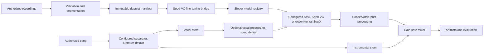

# Neural Singing Voice Platform

A modular Audio ML platform for converting authorized songs into a voice model trained or conditioned only on authorized singer recordings. The repository owns the audio validation, dataset versioning, orchestration, evaluation, artifacts, jobs, API, and UI; pretrained systems are isolated behind adapters.

> This project is for consent-based voice conversion. Do not use it to impersonate people or process music/voices without permission.

## v0.3 validation status

This is a v0.3 work in progress; package versions remain 0.2.0 until the release audit is complete. The existing pipeline now includes run manifests, local ASR and singer-similarity evaluators, benchmark comparisons, persistent blind A/B listening, dataset audits, cancellation and device coordination.

Local real-model validation completed on an AMD RX 7700 XT in WSL Ubuntu with ROCm 7.2 and Torch 2.9.1. The pinned Seed-VC checkout was `51383efd921027683c89e5348211d93ff12ac2a8`. A 96.68-second conversion and a separate 10-second, seed-42 comparison of 20 versus 30 diffusion steps succeeded. This verifies those specific configurations, not every backend. Requested fp32 does not mean every internal module used float32. Private recordings and validation artifacts are not published.

The short benchmark took 123.4 and 126.0 seconds respectively, excluding evaluation. Both source-ASR proxy WER values were 1.0; no quality winner is claimed. Faster-whisper and SpeechBrain ECAPA ran locally in a separate CPU environment. Their speech-domain metrics are not singing ground truth. Total peak RAM and VRAM remain unmeasured; sparse provider RSS samples are not suitable for peak-memory comparisons.

Other provider/backend combinations remain unverified unless backed by an explicit compatibility report. SoulX-Singer-SVC remains experimental. Strict replay does not yet verify all auxiliary converter assets or evaluator dependency versions. The release audit remains open.

Synthetic checks test orchestration and metrics, not singer quality. Browser checks covered desktop/mobile layout, upload, preparation, explicit source selection, playback and benchmark result rendering.

## Architecture



Long-running work is persisted as a SQLite job and executed by a separate worker. The API never runs model inference in an HTTP background callback.

## Technology choices

- Python 3.10–3.12 core; Python 3.10 is recommended for Seed-VC compatibility.
- NumPy/Pydantic core, SoundFile/SciPy audio extras, PyTorch backend-specific ML extras.
- Demucs `htdemucs` adapter for vocals/instrumental stems.
- Seed-VC v1 adapter requiring explicit repository, checkpoint, and config paths.
- Autocorrelation is the default diagnostic F0 extractor; PyWORLD and TorchCREPE are optional analysis alternatives. No extractor quality claim is implied.
- SQLite local jobs, FastAPI API, React/Vite UI, MLflow experiment bridge.

## Install

```powershell
py -3.10 -m venv .venv
.\.venv\Scripts\python -m pip install -e ".[audio,api,dev]"
```

Install PyTorch separately using the official command for CUDA, ROCm, CPU, MPS, or DirectML, then add the relevant extras. Large model weights are never downloaded by normal tests or application startup.

## Quick start without model downloads

```powershell
nsvp doctor
nsvp dataset prepare .\data\raw\my_voice --singer my_voice
pytest -m "not model and not gpu"
```

Generated WAV fixtures exercise validation, segmentation, F0 metrics, artifacts, jobs, and an orchestration vertical slice. The identity converter used there is test-only and is never registered as a singer model.

## Configure real conversion

1. Review and pin a Seed-VC commit:

   ```powershell
   nsvp models download-seed-vc .\third_party\seed-vc --commit <reviewed-commit>
   ```

2. Download the reviewed 44.1 kHz F0-conditioned SVC checkpoint separately.
3. Set `providers.seed_vc.repository_root`, `checkpoint_path`, `config_path`, and a reviewed full `revision` in `configs/default.yaml`. Set its `python_executable` to the separately installed upstream environment.
4. Provision all auxiliary weights locally. Set `providers.demucs.python_executable` and `model_repository` to a local Demucs environment and model repository.
5. Run:

   ```powershell
   nsvp convert .\input\song.wav --reference .\input\my_voice.wav --output-name demo
   ```

Outputs are content-addressed and include vocal/instrumental stems, raw and processed converted vocals, final mix, and an honest JSON report.

Seed-VC records subprocess duration and sampled process-tree RSS in `model_process.json`, including failed or timed-out runs when monitoring started. Evaluation exposes these as provider-scoped performance metrics. Sampling occurs approximately every 100 ms, can count shared pages twice, and can miss short peaks. It excludes the core process and GPU memory. Total peak RAM and VRAM remain unmeasured.

Strict reproduction requires matching source code, configuration and converter identity. When local content or singer evaluators are enabled, it also verifies the recorded evaluation report and the current evaluator model-directory hashes before inference. Missing evaluator identity or changed files reject reproduction. This does not certify unchanged evaluator dependencies or all auxiliary converter assets.

## API and UI

```powershell
uvicorn nsvp.api:app --reload
nsvp worker
cd apps\web
pnpm install
pnpm dev
```

The API exposes health/capabilities, uploads, models, dataset analysis, vocal preparation, conversion, evaluation and benchmark jobs, cancellation, artifacts, and Prometheus-compatible job counts. The UI selects providers/profiles, backend, precision and transposition; plays source/output artifacts; and displays metric status and benchmark results. The local SQLite profile supports one worker.

## Testing

```powershell
pytest -m "not model and not gpu"
ruff check src tests
mypy src/nsvp
```

Model/GPU tests are marked separately. Real hardware results must not be claimed until they have been measured on the stated configuration.

Frontend checks use Node 24 and the existing TypeScript compiler:

```powershell
pnpm --dir apps/web typecheck
pnpm --dir apps/web lint
pnpm --dir apps/web test
```

The lint command checks unused declarations and switch fallthrough through TypeScript; it is not an ESLint or React Hooks ruleset. Native Node tests cover API validation, provider availability, error responses and cancellation. The production build also runs type checking.

`nsvp compatibility-report <manifest_artifact_id>` verifies a completed real conversion's artifact hashes and audio before reporting its recorded provider, checkpoint, backend, device and runtime. Use the configuration that owns the artifacts. The same report is available at `GET /compatibility-report?manifest_artifact_id=...` (repeat the parameter for multiple runs). Omit manifests to inspect adapter support without claiming execution. Include explicit failed jobs with `--failed-job <job_id>` or the API's `failed_job_id` query parameter. Failures record requested selections and a sanitized error code; they do not establish hardware incompatibility. Reports cover only supplied evidence. Requested precision may differ from internal module dtypes, and successful execution does not establish perceptual quality.

The web CI job builds the UI and runs `scripts/test_listening_browser.cjs` against `scripts/browser_fixture.py`, a disposable local API and worker with synthetic conversions. It checks uploads, benchmark submission and polling, evaluation results, artifact playback, blind identities, required ratings, playback switching and persisted scores after reload. Playwright and Chromium are test-only dependencies. This check does not establish real-model quality. Remote CI execution is not yet verified for v0.3.

Set `NSVP_SCREENSHOT_DIRECTORY` when running that browser check to save workspace, blind-listening, pitch and waveform PNGs. Start a fresh disposable fixture for each run. These screenshots use synthetic audio and must not be presented as real-model benchmark evidence.

## Repository map

- `src/nsvp/audio`: decoding, preprocessing, segmentation, mixing.
- `src/nsvp/adapters`: Demucs, Seed-VC, SoulX and external Python runners.
- `src/nsvp/components.py`: provider and profile resolution.
- `src/nsvp/benchmarking.py`: reproducible case/configuration/seed matrices and JSON/HTML reports.
- `src/nsvp/datasets.py`: deterministic datasets and reports.
- `src/nsvp/pipeline.py`: conversion orchestration.
- `src/nsvp/jobs.py`, `api.py`: durable local jobs and service API.
- `apps/web`: local React UI.
- `docs`: local, ignored architecture notes and validation reports.

## Limitations

Source separation bleed, reverb, backing vocals, limited training range, extreme techniques, high notes, language coverage, and speech-trained similarity embeddings can all reduce quality. Default separation treats vocals as one stem. Multi-singer contracts and explicit source selection exist, but the real UNMIXX integration is deferred. Content and timbre metrics remain null without a reviewed evaluator. SVS, real-time conversion, cloud storage, distributed workers and user accounts are outside v0.2.
