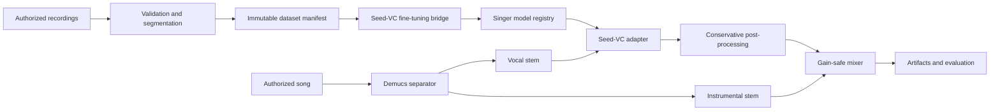

# Neural Singing Voice Platform

A modular Audio ML platform for converting authorized songs into a voice model trained or conditioned only on authorized singer recordings. The repository owns the audio validation, dataset versioning, orchestration, evaluation, artifacts, jobs, API, and UI; pretrained systems are isolated behind adapters.

> This project is for consent-based voice conversion. Do not use it to impersonate people or process music/voices without permission.

## Current verified state

The dependency-light pipeline is implemented and tested with generated audio. Demucs, TorchCREPE, Seed-VC, MLflow, GPU backends, and real singer quality require their optional dependencies, reviewed weights, authorized audio, and hardware-specific validation. No quality or performance result is claimed before measurement; see [PROJECT_REPORT.md](PROJECT_REPORT.md).

## Architecture



Long-running work is persisted as a SQLite job and executed by a separate worker. The API never runs model inference in an HTTP background callback.

## Technology choices

- Python 3.10–3.12 core; Python 3.10 is recommended for Seed-VC compatibility.
- NumPy/Pydantic core, SoundFile/SciPy audio extras, PyTorch backend-specific ML extras.
- Demucs `htdemucs` adapter for vocals/instrumental stems.
- Seed-VC v1 adapter requiring explicit repository, checkpoint, and config paths.
- TorchCREPE default production analysis F0; PyWORLD and dependency-light autocorrelation alternatives.
- SQLite local jobs, FastAPI API, React/Vite UI, MLflow experiment bridge.

## Install

```powershell
py -3.10 -m venv .venv
.\.venv\Scripts\python -m pip install -e ".[audio,api,dev]"
```

Install PyTorch separately using the official command for CUDA, ROCm, CPU, MPS, or DirectML, then add the relevant extras. Large model weights are never downloaded by normal tests or application startup.

## Quick start without model downloads

```powershell
nsvp doctor
nsvp dataset prepare .\data\raw\my_voice --singer my_voice
pytest -m "not model and not gpu"
```

Generated WAV fixtures exercise validation, segmentation, F0 metrics, artifacts, jobs, and an orchestration vertical slice. The identity converter used there is test-only and is never registered as a singer model.

## Configure real conversion

1. Review and pin a Seed-VC commit:

   ```powershell
   nsvp models download-seed-vc .\third_party\seed-vc --commit <reviewed-commit>
   ```

2. Download the reviewed 44.1 kHz F0-conditioned SVC checkpoint separately.
3. Set `seed_vc_root`, `seed_vc_checkpoint`, and `seed_vc_config` in `configs/default.yaml`.
4. Install the backend-specific PyTorch build plus `.[audio,separation,ml]`.
5. Run:

   ```powershell
   nsvp convert .\input\song.wav --reference .\input\my_voice.wav --output-name demo
   ```

Outputs are content-addressed and include vocal/instrumental stems, raw and processed converted vocals, final mix, and an honest JSON report.

## API and UI

```powershell
uvicorn nsvp.api:app --reload
nsvp worker
cd apps\web
pnpm install
pnpm dev
```

The API exposes health/capabilities, uploads, models, dataset analysis jobs, conversion jobs, cancellation, artifacts, and Prometheus-compatible job counts. The local SQLite profile supports one worker; distributed scheduling is intentionally not claimed.

## Testing

```powershell
pytest
ruff check src tests
mypy src/nsvp
```

Model/GPU tests are marked separately. Real hardware validation results belong in `docs/BACKEND_MATRIX.md` and must state “Not tested” until executed.

## Repository map

- `src/nsvp/audio`: decoding, preprocessing, segmentation, mixing.
- `src/nsvp/adapters`: Demucs and Seed-VC boundaries.
- `src/nsvp/datasets.py`: deterministic datasets and reports.
- `src/nsvp/pipeline.py`: conversion orchestration.
- `src/nsvp/jobs.py`, `api.py`: durable local jobs and service API.
- `apps/web`: local React UI.
- `TECHNICAL_WALKTHROUGH.md`: code-level teaching guide.
- `docs`: architecture, modeling, audio, decisions, interviews, and future work.

## Limitations

Source separation bleed, reverb, backing vocals, limited training range, extreme techniques, high notes, language coverage, and speech-trained similarity embeddings can all reduce quality. V1 treats all vocals as one stem. Real-time conversion, cloud object storage, distributed workers, and multi-user production security are future designs, not implemented claims.


