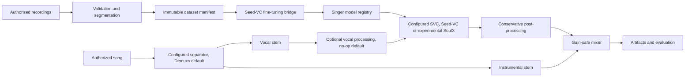

# Neural Singing Voice Platform

A modular Audio ML platform for converting authorized songs into a voice model trained or conditioned only on authorized singer recordings. The repository owns the audio validation, dataset versioning, orchestration, evaluation, artifacts, jobs, API, and UI; pretrained systems are isolated behind adapters.

> This project is for consent-based voice conversion. Do not use it to impersonate people or process music/voices without permission.

## v0.2 status

The dependency-light pipeline, provider selection, vocal preparation, evaluation families, dataset audits, benchmark jobs and UI build are tested with generated audio. Seed-VC and Demucs remain defaults. SoulX-Singer-SVC is an optional experimental adapter with its own Python environment and explicitly provisioned offline assets. Real model inference and model/backend compatibility remain `not_tested` / `not_verified` in this checkout.

See [v0.2 migration and operation](docs/V02_GUIDE.md), [provider capabilities](docs/reports/provider-capabilities.json), and the generated [synthetic comparison report](docs/reports/synthetic-benchmark.html). The synthetic report tests orchestration and metrics, not singer quality. Browser checks covered desktop/mobile layout, upload, preparation, explicit source selection, playback and benchmark result rendering.

## Architecture



Long-running work is persisted as a SQLite job and executed by a separate worker. The API never runs model inference in an HTTP background callback.

## Technology choices

- Python 3.10–3.12 core; Python 3.10 is recommended for Seed-VC compatibility.
- NumPy/Pydantic core, SoundFile/SciPy audio extras, PyTorch backend-specific ML extras.
- Demucs `htdemucs` adapter for vocals/instrumental stems.
- Seed-VC v1 adapter requiring explicit repository, checkpoint, and config paths.
- Autocorrelation is the default diagnostic F0 extractor; PyWORLD and TorchCREPE are optional analysis alternatives. No extractor quality claim is implied.
- SQLite local jobs, FastAPI API, React/Vite UI, MLflow experiment bridge.

## Install

```powershell
py -3.10 -m venv .venv
.\.venv\Scripts\python -m pip install -e ".[audio,api,dev]"
```

Install PyTorch separately using the official command for CUDA, ROCm, CPU, MPS, or DirectML, then add the relevant extras. Large model weights are never downloaded by normal tests or application startup.

## Quick start without model downloads

```powershell
nsvp doctor
nsvp dataset prepare .\data\raw\my_voice --singer my_voice
pytest -m "not model and not gpu"
```

Generated WAV fixtures exercise validation, segmentation, F0 metrics, artifacts, jobs, and an orchestration vertical slice. The identity converter used there is test-only and is never registered as a singer model.

## Configure real conversion

1. Review and pin a Seed-VC commit:

   ```powershell
   nsvp models download-seed-vc .\third_party\seed-vc --commit <reviewed-commit>
   ```

2. Download the reviewed 44.1 kHz F0-conditioned SVC checkpoint separately.
3. Set `providers.seed_vc.repository_root`, `checkpoint_path`, `config_path`, and a reviewed full `revision` in `configs/default.yaml`. Set its `python_executable` to the separately installed upstream environment.
4. Provision all auxiliary weights locally. Set `providers.demucs.python_executable` and `model_repository` to a local Demucs environment and model repository. See [asset requirements](docs/V02_GUIDE.md).
5. Run:

   ```powershell
   nsvp convert .\input\song.wav --reference .\input\my_voice.wav --output-name demo
   ```

Outputs are content-addressed and include vocal/instrumental stems, raw and processed converted vocals, final mix, and an honest JSON report.

## API and UI

```powershell
uvicorn nsvp.api:app --reload
nsvp worker
cd apps\web
pnpm install
pnpm dev
```

The API exposes health/capabilities, uploads, models, dataset analysis, vocal preparation, conversion, evaluation and benchmark jobs, cancellation, artifacts, and Prometheus-compatible job counts. The UI selects providers/profiles, backend, precision and transposition; plays source/output artifacts; and displays metric status and benchmark results. The local SQLite profile supports one worker.

## Testing

```powershell
pytest -m "not model and not gpu"
ruff check src tests
mypy src/nsvp
```

Model/GPU tests are marked separately. Real hardware results must not be claimed until they have been measured on the stated configuration.

## Repository map

- `src/nsvp/audio`: decoding, preprocessing, segmentation, mixing.
- `src/nsvp/adapters`: Demucs, Seed-VC, SoulX and external Python runners.
- `src/nsvp/components.py`: provider and profile resolution.
- `src/nsvp/benchmarking.py`: reproducible case/configuration/seed matrices and JSON/HTML reports.
- `src/nsvp/datasets.py`: deterministic datasets and reports.
- `src/nsvp/pipeline.py`: conversion orchestration.
- `src/nsvp/jobs.py`, `api.py`: durable local jobs and service API.
- `apps/web`: local React UI.
- `docs`: public architecture, modeling, audio pipeline, and engineering decisions.

## Limitations

Source separation bleed, reverb, backing vocals, limited training range, extreme techniques, high notes, language coverage, and speech-trained similarity embeddings can all reduce quality. Default separation treats vocals as one stem. Multi-singer contracts and explicit source selection exist, but the real UNMIXX integration is deferred. Content and timbre metrics remain null without a reviewed evaluator. SVS, real-time conversion, cloud storage, distributed workers and user accounts are outside v0.2.
