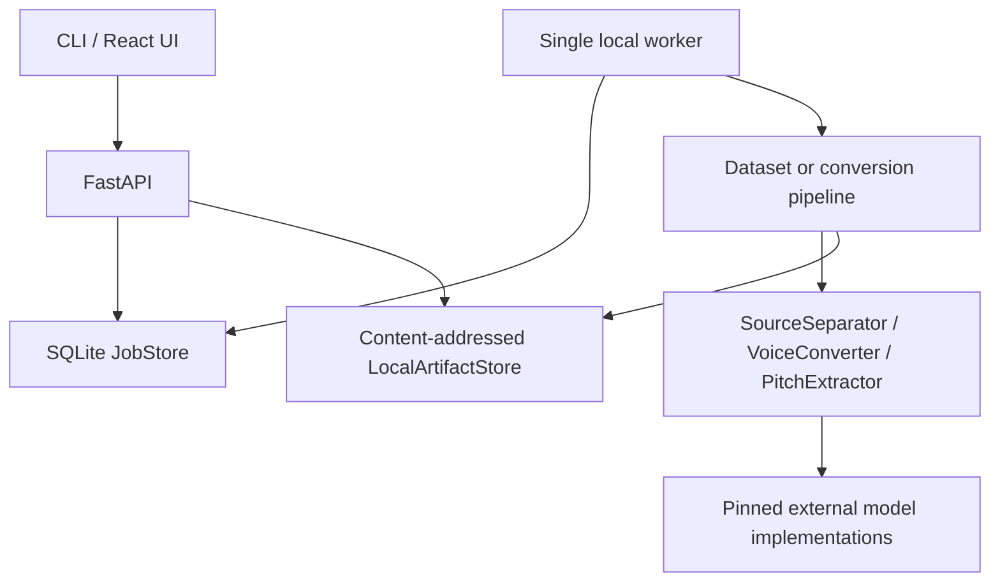

# Architecture

## Boundaries

The domain types in `contracts.py` are shared by CLI, API, storage, and ML adapters. Audio is always `float32 [channels, samples]` with an explicit sample rate. Physical artifact paths never enter the public API; clients receive immutable IDs.

`DeviceManager` detects native CUDA/ROCm, DirectML, MPS, or CPU without importing torch at package import time. A component may still reject a backend; this must be surfaced rather than silently hidden.

## Training flow

Files are decoded, validated, converted to mono 44.1 kHz, DC-centered, segmented near silence, checksummed, and assigned to a split at source-file level. `SeedVCTrainingBridge` exports a deterministic upstream dataset description. A checkpoint can enter `ModelRegistry` only after the caller confirms load and inference smoke tests.

## Inference flow

`ConversionPipeline` loads the song/reference, calls the separator, converts the vocal, removes residual DC, mixes against the instrumental with common headroom, and stores six artifacts. It uses `try/finally` to honor intermediate-retention policy.

## Storage and jobs

Local storage is filesystem-based and content-addressed. SQLite WAL mode provides durable status for one local worker. Production scaling would replace these implementations behind their boundaries; V1 does not promise multi-worker SQLite safety.

