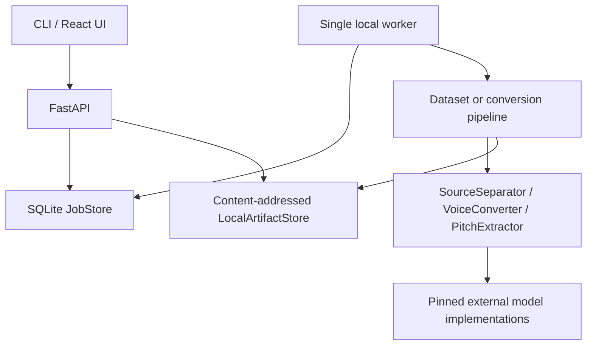

# Architecture

## Boundaries

The domain types in `contracts.py` are shared by CLI, API, storage, and ML adapters. Audio is always `float32 [channels, samples]` with an explicit sample rate. Physical artifact paths never enter the public API; clients receive immutable IDs.

`DeviceManager` detects native CUDA/ROCm, DirectML, MPS, or CPU without importing torch at package import time. A component may still reject a backend; this must be surfaced rather than silently hidden.

## Training flow

Files are decoded, validated, converted to mono 44.1 kHz, DC-centered, segmented near silence, checksummed, and assigned to a split at source-file level. `SeedVCTrainingBridge` exports a deterministic upstream dataset description. A checkpoint can enter `ModelRegistry` only after the caller confirms load and inference smoke tests.

## Inference flow

`ComponentFactory` resolves typed provider configuration, named profiles and registered models outside `ConversionPipeline`. Providers may use separate Python interpreters. Environment probing detects available hardware; it never certifies model compatibility.

`ConversionPipeline` loads the song/reference, optionally separates stems, runs ordered vocal preprocessing, converts the selected vocal, removes residual DC and mixes against the instrumental with common headroom. Direct vocal input bypasses the separator. The five primary WAVs and conversion report remain available. The shared CLI/worker handler adds a separate evaluation report. Optional stage artifacts, selected converter input, original model output and model diagnostics are also stored when applicable. Disposable work is cleaned in `finally`; primary audio and diagnostic evidence remain content-addressed.

Vocal preparation stores numbered sources and an immutable manifest. Conversion must specify a source ID belonging to that manifest. No algorithm silently chooses a singer. The production multi-singer implementation is deferred; only explicit test dependencies can provide synthetic sources.

`BenchmarkRunner` expands cases, configurations and seeds, resolves identical source/reference artifacts for each comparison, records input hashes and component execution metadata, and persists JSON/HTML after each row. Missing configuration is `not_tested`, unsupported execution settings are `unsupported`, and execution failures contain no invented metrics. Benchmark jobs share the SQLite worker.

HTTP dataset inputs use uploaded artifact IDs. Local filesystem paths remain CLI-only. Public job projections redact configured paths and replace worker exceptions with a safe error message. Detailed failures stay local. Provider implementations cannot be imported from user-supplied API code.

## Storage and jobs

Local storage is filesystem-based and content-addressed. SQLite WAL mode provides durable status for one local worker. Production scaling would replace these implementations behind their boundaries; V1 does not promise multi-worker SQLite safety.
